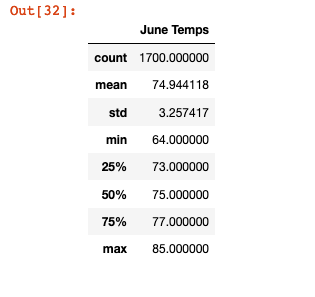
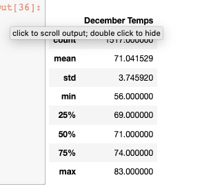
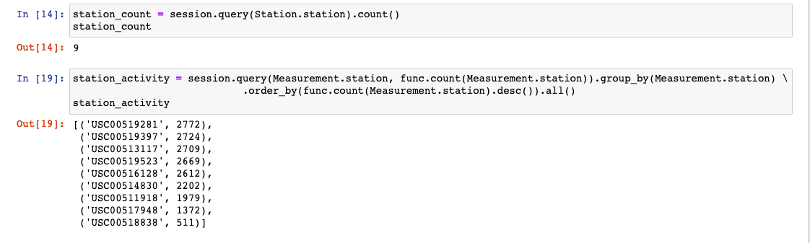

### Surfs_up
module 9

### Purpose

W. Avy likes your analysis, but he wants more information about temperature trends before opening the surf shop. Specifically, he wants temperature data for the months of June and December in Oahu, in order to determine if the surf and ice cream shop business is sustainable year-round. Using Python, Pandas functions and methods, and SQLAlchemy, you’ll filter the date column of the Measurements table in the hawaii.sqlite database to retrieve all the temperatures for the month of June. You’ll then convert those temperatures to a list, create a DataFrame from the list, and generate the summary statistics.

### Results

Here are the results for temperatures in June
 
 
 
Here are the results for temperatures in December
 

*The minimim temperature for December is 56 and for June is 64

*The maximum temperature for December is 83 and for June is 85

*The mean for December is 71.04 and for June is 74.94

### Summary

Given these differences, I would conclude that the degree changes between December and June would not make a big impact on the sales of ice cream in Oahu. 

Additionally, we can find more information to include in our analysis.

Here, we have foud the total number of stations as well as the activity at each one.
